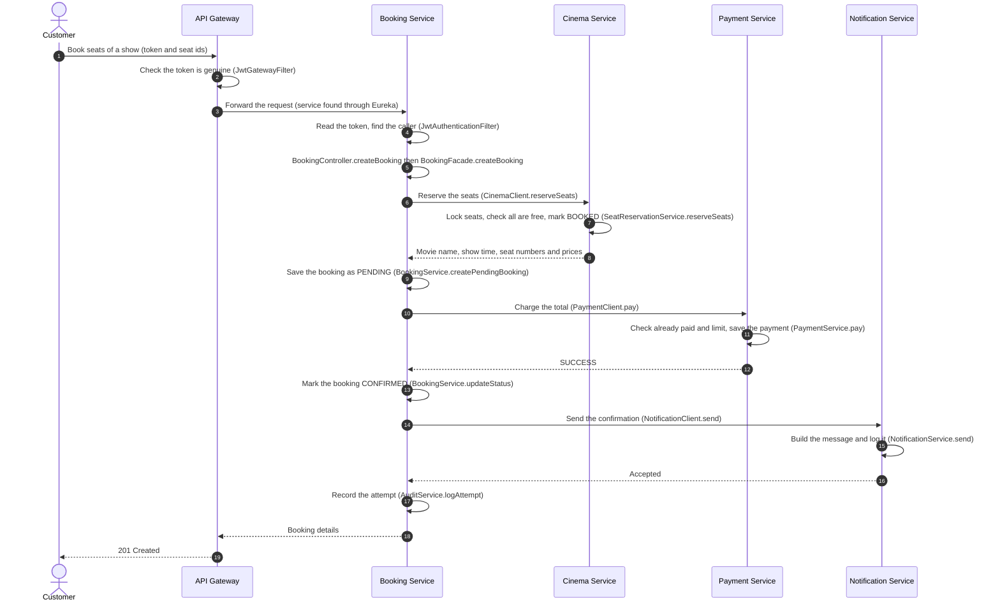
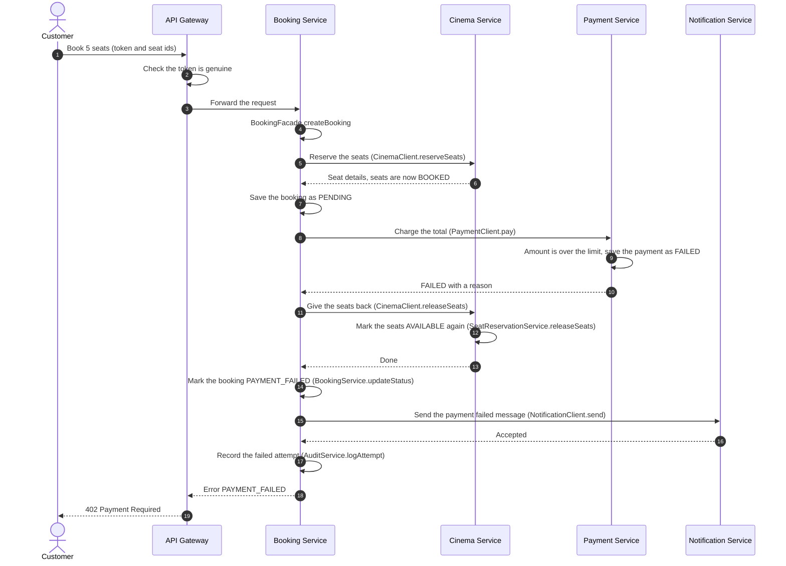
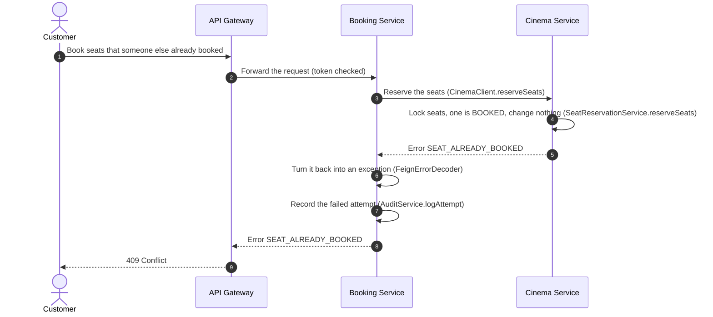

# Booking Flow

How a customer books seats, from the first request to the notification.

Services involved:

- **API Gateway:** the single front door
- **Booking Service:** runs the booking from start to end
- **Cinema Service:** owns the movies, shows and seats
- **Payment Service:** takes the payment
- **Notification Service:** tells the customer what happened

---

## 1. Simple flow: how a booking is done

**Before the booking:** the customer logs in with the User Service and gets an access token. The token is a signed pass that carries the user id, the email and the role. The customer sends it with every protected request.

1. **The customer sends a booking request.** The request says which show and which seats, and carries the token. It goes to the Gateway, never directly to a service.

2. **The Gateway checks the token.** `JwtGatewayFilter` makes sure the token is genuine and not expired. A missing or fake token is turned away here with `401`, and no service ever sees it. If the token is fine, the Gateway looks up Booking Service in Eureka and forwards the request.

3. **Booking Service finds out who is calling.** `JwtAuthenticationFilter` checks the token again, because every service verifies for itself. It builds the caller (`AuthUser`: id, email, role). Then `BookingController.createBooking` hands the request to `BookingFacade.createBooking`.

4. **Booking Service asks Cinema Service to reserve the seats.** `CinemaClient.reserveSeats` makes the call, and `FeignConfig` copies the customer's token onto it, so Cinema Service knows who is behind the request. Cinema Service runs `SeatReservationService.reserveSeats`, which:
   - locks the requested seats so nobody else can touch them at the same moment,
   - checks that every seat exists, belongs to this show and is still free,
   - marks all of them as booked, or none of them if even one is taken,
   - sends back the movie name, the show time, and each seat's number and price.

5. **Booking Service saves the booking as PENDING.** `BookingService.createPendingBooking` copies the movie name, show time, seat numbers and prices into its own database, and adds up the total. It saves the booking before payment because the payment needs a booking number to be charged against.

6. **Booking Service asks Payment Service to charge the total.** `PaymentClient.pay` makes the call. `PaymentService.pay` first checks that this booking is not already paid. It then checks the amount against the limit. Within the limit, the payment is recorded as SUCCESS. Over the limit, it is recorded as FAILED with a reason. The answer goes back to Booking Service either way.

7. **If the payment succeeded, the booking is confirmed.** `BookingService.updateStatus` changes the booking from PENDING to CONFIRMED.

8. **Booking Service tells Notification Service.** `NotificationClient.send` makes the call. `NotificationService.send` writes the message ("Your booking is confirmed") and hands it to `LogNotificationSender.send`, which logs it. If sending fails for any reason, Booking Service ignores it, because a failed message must never undo a confirmed booking.

9. **The attempt is recorded.** `AuditService.logAttempt` writes a row for this attempt, successful or not. It uses its own separate transaction so the record stays even when the booking fails.

10. **The customer gets the answer.** `BookingMapper.toResponse` builds the response with the booking number, movie, show time, seat numbers, total and status. It returns through the Gateway as `201 Created`.

**Two rules the flow follows:**

- No database transaction stays open while another service is being called. Each save is its own short step.
- The data copied into the booking (movie name, seats, prices) means Booking Service never has to ask Cinema Service again just to show a booking.

---

## 2. What happens when something goes wrong

- **A seat is already taken.** Cinema Service refuses the whole request and changes nothing. Booking Service saves nothing and the customer gets `409`.
- **Cinema Service is down.** Nothing has been done yet, so nothing needs undoing. The customer gets `503` or `502`.
- **The booking cannot be saved after the seats were reserved.** Booking Service gives the seats back with `CinemaClient.releaseSeats`, which runs `SeatReservationService.releaseSeats`, and then reports the error.
- **The payment is declined (amount over the limit).** Booking Service releases the seats and marks the booking PAYMENT_FAILED, so a record of the attempt remains. It sends a "payment failed" notification, and the customer gets `402`.
- **Payment Service is down or unreachable.** The same clean-up as a declined payment. The customer gets `503` or `502`.
- **Notification Service is down.** Nothing changes for the customer. The booking stays confirmed, and Booking Service writes a warning in its log.

---

## 3. Sequence diagrams

### 3.1 Successful booking

### 3.2 Payment declined

### 3.3 Seat already taken

