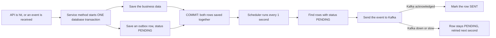
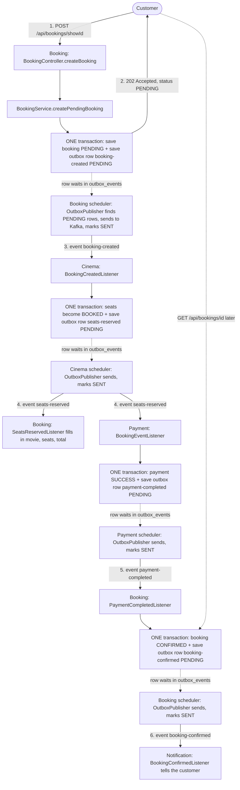
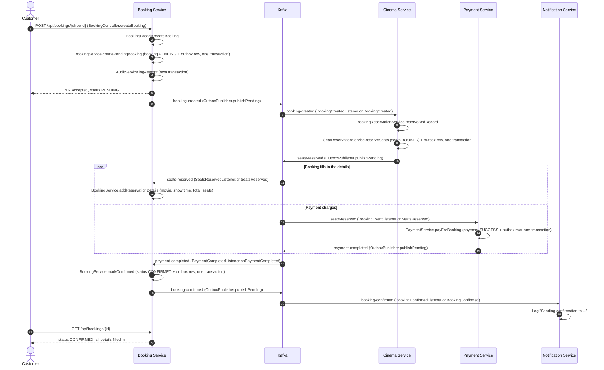
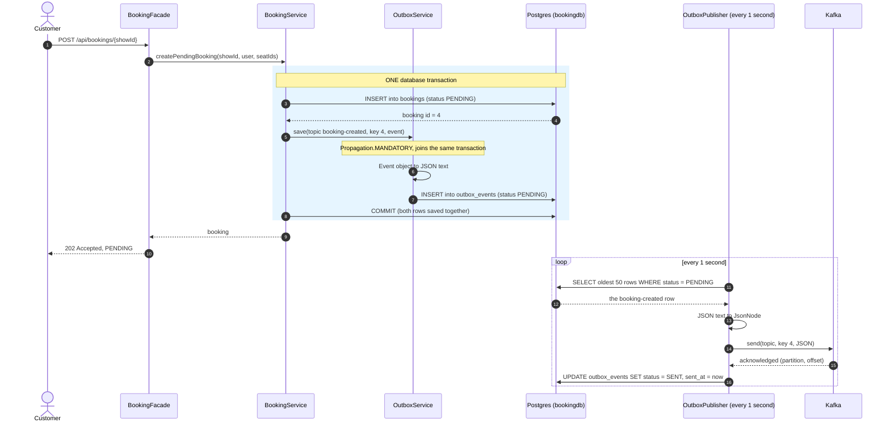
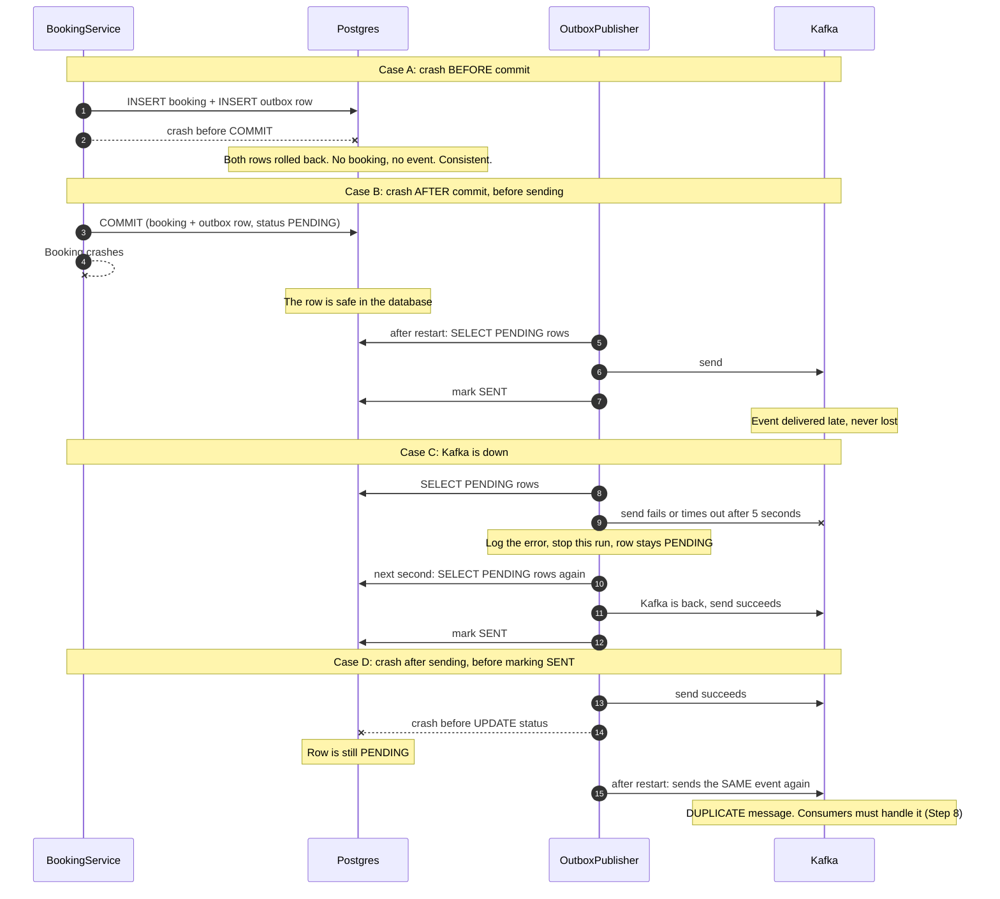

# Phase 8: Happy Flow and Outbox (in depth)

State of the project: after Step 6. Booking, Cinema and Payment all use the outbox. Step 7 (idempotency keys) is not applied yet.

---

# Part 1: Happy flow

## 1.1 What happens, in plain words

A customer books two free seats. The amount is within the payment limit. Everything works.

1. The customer sends the booking request. Booking saves it as `PENDING` and answers `202` right away.
2. Cinema hears about the new booking, reserves the seats, and says "seats reserved".
3. Two services hear that. Booking copies the movie, time, seats and total into the booking. Payment charges the money.
4. Payment says "payment completed".
5. Booking marks the booking `CONFIRMED` and says "booking confirmed".
6. Notification hears that and tells the customer.

Nobody waits for anybody. Each service reacts to the previous service's event. This is a choreography saga.

## 1.2 The outbox idea in one small diagram

Every hop in the happy flow below uses this same pattern. Read this first.



In words:

1. The API hit (or an incoming event) reaches a service method.
2. The method saves the business data and an outbox row **in the same transaction**. Nothing is sent to Kafka here.
3. After the commit, the response goes back to the caller.
4. A scheduler looks for `PENDING` outbox rows every second and sends each one to Kafka.
5. Only after Kafka confirms is the row marked `SENT`. If Kafka fails, the row stays `PENDING` and is tried again.

## 1.3 Flow diagram of the happy path (with the outbox at every hop)



How to read it:

- Solid arrows between services are Kafka events.
- Each "ONE transaction" box is where data and the outbox row are saved together. Nothing goes to Kafka from inside it.
- Each dotted arrow is the outbox row waiting in the table until that service's scheduler picks it up.
- Notification publishes nothing, so it has no outbox.

## 1.4 Topics and who owns them

- `booking-created`: published by Booking, read by Cinema
- `seats-reserved`: published by Cinema, read by Booking and Payment
- `payment-completed`: published by Payment, read by Booking
- `booking-confirmed`: published by Booking, read by Notification

The service that publishes a topic creates it (`KafkaTopicConfig`).

## 1.5 How everything works, step by step

**Step 1: Booking accepts the request**

- `BookingController.createBooking` calls `BookingFacade.createBooking`.
- `BookingFacade` calls `BookingService.createPendingBooking`. One database transaction saves two rows: the booking (`PENDING`) and an outbox row holding the `BookingCreated` event as JSON.
- `AuditService.logAttempt` records the attempt in its own transaction.
- The customer gets `202` with status `PENDING`. Movie name, total and seats are still empty.

**Step 2: Booking sends the event**

- `OutboxPublisher` (a job that runs every second) finds the pending outbox row, sends it to the topic `booking-created`, and marks the row `SENT`.

**Step 3: Cinema reserves the seats**

- `BookingCreatedListener.onBookingCreated` receives the event.
- It calls `BookingReservationService.reserveAndRecord`. In one transaction, `SeatReservationService.reserveSeats` locks the seats and marks them `BOOKED`, and `OutboxService.save` stores a `SeatsReserved` outbox row.
- Cinema's own `OutboxPublisher` sends it to `seats-reserved`.

**Step 4: Two services read `seats-reserved`**

They have different consumer groups, so each gets its own copy.

- Booking: `SeatsReservedListener` calls `BookingService.addReservationDetails`. It fills in movie name, show time, total and seat numbers.
- Payment: `BookingEventListener.onSeatsReserved` calls `PaymentService.payForBooking`. In one transaction it saves the `SUCCESS` payment and a `PaymentCompleted` outbox row.

These two run independently. Either can finish first. They update different data, which is why `Booking` has `@DynamicUpdate`.

**Step 5: Booking confirms**

- Payment's `OutboxPublisher` sends `payment-completed`.
- Booking's `PaymentCompletedListener` calls `BookingService.markConfirmed`. In one transaction it sets `CONFIRMED` and saves a `BookingConfirmed` outbox row.

**Step 6: Notification tells the customer**

- Booking's `OutboxPublisher` sends `booking-confirmed`.
- Notification's `BookingConfirmedListener` logs the confirmation message.

**Step 7: The customer checks**

- `GET /api/bookings/{id}` now returns `CONFIRMED` with all details filled in.

## 1.6 End state

- Booking table: `CONFIRMED`, with movie, show time, total and seats
- Cinema: the seats are `BOOKED`
- Payment table: one row, `SUCCESS`
- Outbox tables: every row is `SENT`

## 1.7 Sequence diagram of the happy flow



---

# Part 2: The outbox in depth (Booking service)

## 2.1 The problem it solves

Saving to the database and sending to Kafka are two systems. They cannot share one transaction.

Without the outbox, the code was:

```java
bookingService.createPendingBooking(...);   // 1. save to Postgres (committed)
eventPublisher.publishBookingCreated(...);  // 2. send to Kafka
```

A crash, or Kafka being down, between line 1 and line 2 leaves a `PENDING` booking that nobody ever hears about. No error is raised anywhere.

## 2.2 The idea

Do not send to Kafka inside the request. Instead, write the event into a table in the same database transaction as the booking. A separate job sends it later.

The event is then part of the booking's own transaction. Either both are saved, or neither is.

## 2.3 The pieces in Booking

- `db/migration/V6__create_outbox_events_table.sql`: the `outbox_events` table
- `outbox.OutboxEvent`: the row (topic, key, JSON payload, status)
- `outbox.OutboxRepository`: finds the oldest `PENDING` rows
- `outbox.OutboxService`: `save` (must run inside a transaction), `findUnsent`, `markSent`
- `kafka.publisher.OutboxPublisher`: the job that sends rows to Kafka every second
- `service.BookingService`: every status change saves its event through `OutboxService`

**The outbox table**

- `event_id`: unique id of the event
- `topic`: where to send it, for example `booking-created`
- `message_key`: the booking id, so one booking's events stay in order
- `payload`: the event as JSON text
- `status`: `PENDING` or `SENT`
- `created_at`, `sent_at`

## 2.4 Sequence diagram: saving and sending (normal case)



## 2.5 What the tables look like

Right after the request commits:

- `bookings`: id 4, status `PENDING`
- `outbox_events`: event `a1b2`, topic `booking-created`, key `4`, status `PENDING`

About one second later, after the publisher runs:

- `outbox_events`: the same row, status `SENT`, `sent_at` filled in

The JSON payload stored in the row:

```json
{"eventId":"a1b2","bookingId":4,"userId":3,"showId":1,"seatIds":[1,4]}
```

Only text is stored. The class name is not. The topic tells the consumer which class to use.

## 2.6 Sequence diagram: what happens when things fail



## 2.7 What the outbox guarantees, and what it does not

**Guaranteed: no lost events.** If the booking is saved, its event is saved. The publisher keeps trying until Kafka confirms.

**Not guaranteed: no duplicates.** Case D sends the same event twice. This is at-least-once delivery. Step 8 (idempotent consumers) makes a duplicate harmless.

**Order is kept per booking.** Rows are sent oldest first, and the message key is the booking id, so all events of one booking go to the same partition in order. If one send fails, the publisher stops the run, so a later event never overtakes an earlier one.

## 2.8 Rules that make it work

1. **`OutboxService.save` uses `Propagation.MANDATORY`.** Called outside a transaction, it throws. This stops anyone from saving the event separately from the data.
2. **Only `OutboxPublisher` talks to Kafka.** No other class in Booking uses `KafkaTemplate`. A direct send would bring the old gap back.
3. **Every status change goes through `BookingService`.** Each method (`createPendingBooking`, `markConfirmed`, `markPaymentFailed`, `markSeatsUnavailable`, `markCancelled`) saves its event in the same transaction. There is no plain `updateStatus` any more.
4. **`BookingFacade` is not `@Transactional`.** The transaction lives in `BookingService`, and nothing waits on an outside system while it is open.
5. **A row is marked `SENT` only after Kafka confirms.** The publisher waits for the acknowledgement (up to 5 seconds) before updating the row.

## 2.9 Known limits (left for later)

- **Several Booking instances:** two publishers could pick the same row and send it twice. Real systems use `SELECT ... FOR UPDATE SKIP LOCKED`. We run one instance, so we do not need it.
- **Polling delay:** an event can wait up to one second before it is sent. Debezium (reading the database log) removes the polling, but needs Kafka Connect.
- **Old rows pile up:** `SENT` rows stay in the table. A cleanup job can delete old ones.
- **Duplicates:** handled in Step 8.

## 2.10 The same pattern in Cinema and Payment

The pieces are identical, with one difference: the change and the event are saved by a service method called from a Kafka listener.

- Cinema: `BookingReservationService.reserveAndRecord` saves the `BOOKED` seats and the `SeatsReserved` row in one transaction.
- Payment: `PaymentService.payForBooking` saves the payment and the `PaymentCompleted` or `PaymentFailed` row in one transaction.

## 2.11 Interview line

"The database and Kafka cannot share a transaction, so a crash between them lost events. I used the transactional outbox: each status change writes its event to an outbox table in the same transaction, and a scheduled publisher sends the rows to Kafka and marks them sent. That gives at-least-once delivery with no lost events, so I make the consumers idempotent."
