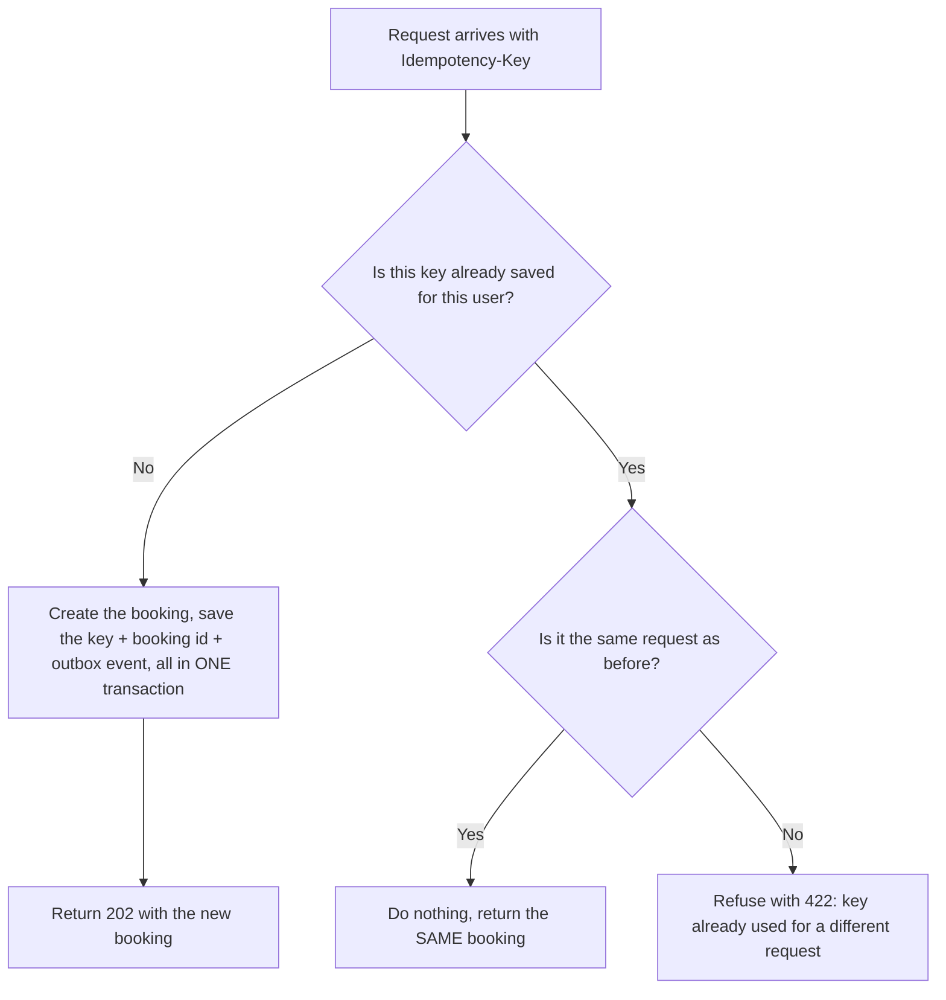
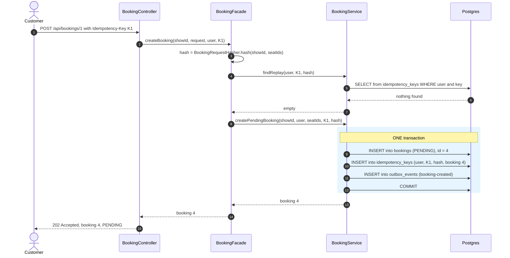
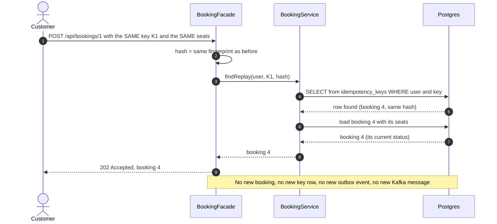
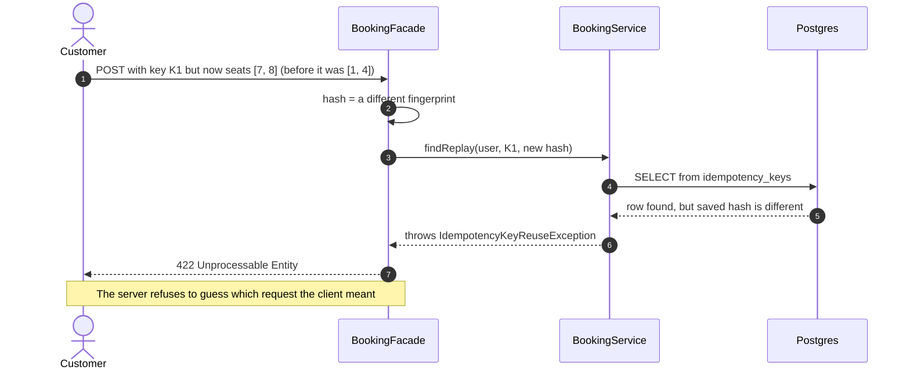
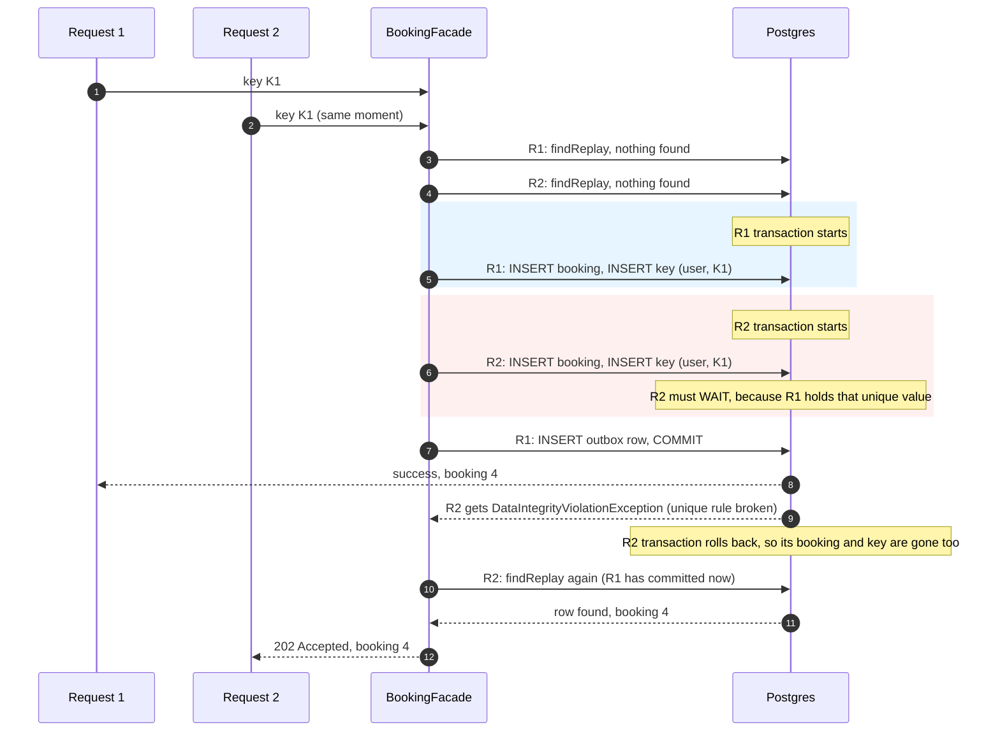
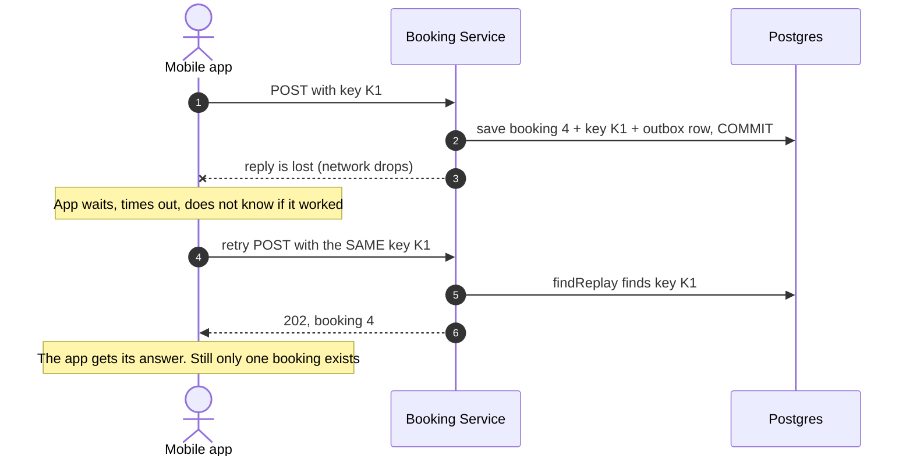

# Idempotency Key (explained with the Booking service)

Idempotent means: doing the same thing twice has the same result as doing it once.

---

## 1. The problem

A customer taps "Book" and nothing seems to happen. The internet is slow. So the customer taps again. Or the mobile app waits 10 seconds, gives up, and sends the request again by itself.

The server cannot tell the difference between:

- two different bookings that look the same, and
- one booking sent twice by mistake.

Without protection, the result is two bookings, two seat reservations, and possibly two charges.

**Cinema counter example.** A customer says "two tickets for the 6 PM show" and the clerk is slow. The customer says it again. A careless clerk prints four tickets. A careful clerk says "you already asked for that, here are your two tickets". The idempotency key is how the server becomes the careful clerk.

## 2. The idea

The client puts a unique label on each request. The label is called the **idempotency key**. It is sent in a header:

```
POST /api/bookings/1
Idempotency-Key: 7c9e6679-7425-40de-944b-e07fc1f90ae7
```

The server remembers each label together with the result it produced.

- First time the label is seen: do the work, save the label and the result.
- Label seen again with the same request: do **no** work, return the saved result.

The label is just a random string. A UUID is ideal. The client makes one new key per user action, and reuses that same key only when it retries that same action.

## 3. The idea in one picture



## 4. What is saved

A new table in Booking's database: `idempotency_keys` (Flyway `V7`).

- `user_id`: who sent the key
- `idem_key`: the key from the header
- `request_hash`: a fingerprint of the request (show id and seat ids)
- `booking_id`: the result, which booking was created
- `created_at`: used to delete old keys

The table has one important rule: **the pair (`user_id`, `idem_key`) is unique**. The database itself refuses a second row with the same pair. This rule is the real protection. Java code can be fooled by two requests arriving at the same moment, but a database constraint cannot.

The key is unique per user, not for everyone. Two different customers may both send the key `1`, and they must never see each other's booking.

**The fingerprint (`request_hash`).** It is a short code made from the request: the show id and the sorted seat ids, run through SHA-256. Same request, same code. Different seats, different code. The order of seats does not matter, so `[1,4]` and `[4,1]` give the same code. It lets the server notice "same key, but this is a different request", which is a client mistake.

## 5. The classes involved (Booking)

- `controller.BookingController`: reads the `Idempotency-Key` header. A missing header gives `400`.
- `service.BookingFacade`: decides what to do (see section 6). It is **not** `@Transactional`.
- `service.BookingService`: `findReplay` (look up the key) and `createPendingBooking` (save everything)
- `idempotency.BookingRequestHasher`: makes the fingerprint
- `idempotency.IdempotencyKey` and `IdempotencyKeyRepository`: the table
- `idempotency.IdempotencyKeyReuseException`: gives the `422`
- `idempotency.IdempotencyCleanupJob`: deletes keys older than 24 hours, once an hour
- `db/migration/V7__create_idempotency_keys_table.sql`: the table and the unique rule

## 6. What the facade does, step by step

```java
String hash = BookingRequestHasher.hash(showId, seatIds);

// 1. Seen this key before?
Optional<Booking> existing = bookingService.findReplay(userId, key, hash);
if (existing.isPresent()) return existing.get();

// 2. First time: create it
try {
    return bookingService.createPendingBooking(showId, user, seatIds, key, hash);
} catch (DataIntegrityViolationException ex) {
    // 3. Lost a race against an identical request: return the winner's booking
    return bookingService.findReplay(userId, key, hash).orElseThrow(() -> ex);
}
```

Step 2 saves **three things in one transaction**: the booking, the key row, and the outbox row for `BookingCreated`. All three are saved, or none is.

## 7. Scenarios

### Scenario A: first request (normal)



### Scenario B: the same request again (double click or retry)



The reply shows the booking's **current** status. If the customer retries a minute later, the answer says `CONFIRMED`, not an old `PENDING`.

### Scenario C: same key, different request (client mistake)



### Scenario D: two identical requests at the same moment

This is the hard case. Both requests ask "is the key saved?" and both hear "no", because neither has saved anything yet.



Result: one booking, one key row, one outbox event. Both customers' requests got the same booking.

Two details that matter:

- The `catch` for the duplicate error is in `BookingFacade`, **outside** the transaction. A transaction that hit an error cannot be used again, so Request 2 must start a fresh one to read the winner's booking. This is also why `BookingFacade` is not `@Transactional`.
- If a violation happens but no key row exists afterwards, the problem was something else, and the exception is thrown again instead of being hidden.

### Scenario E: timeout, then retry (the real-life reason for all this)



Without the key, the app would have to choose between "maybe lose the booking" and "maybe book twice". With the key, retrying is always safe.

## 8. What the tables look like

After Scenario A:

- `bookings`: id 4, status `PENDING`
- `idempotency_keys`: user 3, key K1, hash `ab12...`, booking 4
- `outbox_events`: event `booking-created`, status `PENDING`

After Scenario B (the repeat): **nothing changed**. Same three rows.

## 9. Rules that make it work

1. **The key row is saved in the same transaction as the booking.** If they were saved separately, a crash in between could leave a booking with no key (a retry would create a second booking), or a key with no booking (a retry would return nothing).
2. **The unique rule is in the database.** Checking in Java first is only for speed and for returning the nice answer. The constraint decides who wins a race.
3. **The key is unique per user**, so customers cannot see each other's data.
4. **The result is saved as the booking id**, and the reply is built from the booking's current state.
5. **A different request with the same key is refused**, not guessed.
6. **Keys expire after 24 hours.** `IdempotencyCleanupJob` deletes old rows hourly, so the table does not grow forever. After 24 hours, the same key counts as a new request.
7. **The client must send the header.** A missing header gives `400`.

## 10. Things to know

- **A failed booking is also remembered.** If a request ended as `SEATS_UNAVAILABLE`, sending it again with the same key returns that same failed booking. To try again, the client uses a **new key**. A key stands for one user action, not for "keep trying until it works".
- **A request that failed before anything was saved is not remembered.** For example, a validation error saves no key, so the same key can be used again after the client fixes the request.
- **It only protects the API.** It stops a customer's repeated requests. It does not stop Kafka from delivering a message twice. That is a different problem, solved by idempotent consumers in Step 8.
- **Idempotency key and outbox are different tools.** The outbox says "an event is never lost". The key says "a request is never processed twice". Booking uses both, and they are saved in the same transaction.

## 11. Payment uses the same pattern

`POST /api/payments` also takes the header. `PaymentFacade` does the same three steps (look up the key, create, handle the race), and `PaymentService.payOnce` saves the payment and the key together. A repeated request returns the saved payment, so the customer is charged once.

Payment has one extra safety net: a database rule `uq_payments_booking_success` that allows only one `SUCCESS` payment per booking. Even if everything else in the code failed, the database would still refuse a second successful charge.

Inside the saga, Payment is started by the `seats-reserved` Kafka event, not by this endpoint. So this protects the direct API only.

## 12. How to test (Postman)

For normal calls, set the header `Idempotency-Key` to `{{$guid}}`. It is new on every send.

For these tests, type a fixed value such as `test-key-1`.

1. **Repeat:** send the same request twice with `test-key-1`. Both responses show the same booking id, and `bookings` has one new row.
2. **Different request:** send `test-key-1` again with different seats. Expect `422`.
3. **Missing header:** remove it. Expect `400`.
4. **Race:** send two identical requests at the same moment (for example with a runner using two iterations in parallel, or two quick clicks). Expect one booking.
5. **Check the table:** `select * from idempotency_keys;` shows one row per key.

## 13. Interview line

"A client cannot know whether a timed-out request was processed, so it retries, and that can double-book or double-charge. I required an Idempotency-Key header and saved the key together with the booking and its outbox event in one transaction. A repeat returns the saved booking, a reused key with a different request gets a 422, and a unique constraint decides the winner when two identical requests arrive together. Keys expire after 24 hours."
