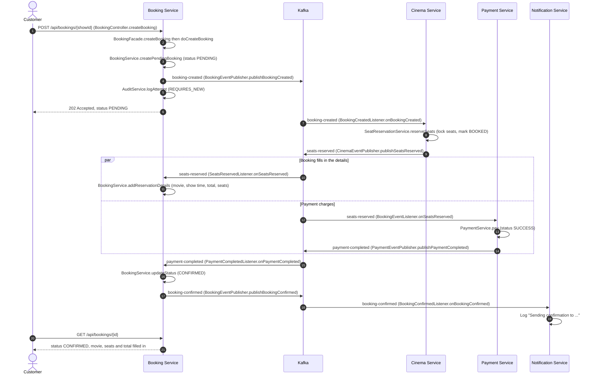
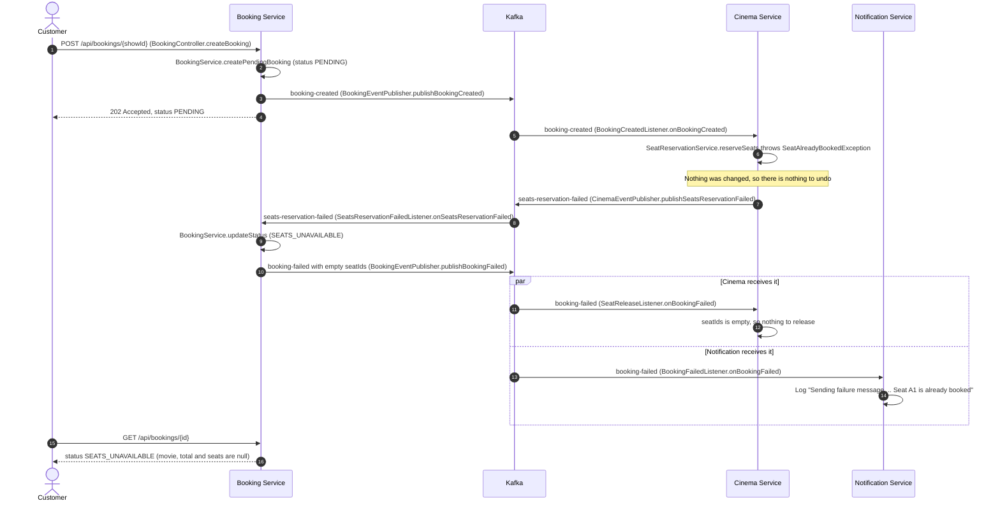
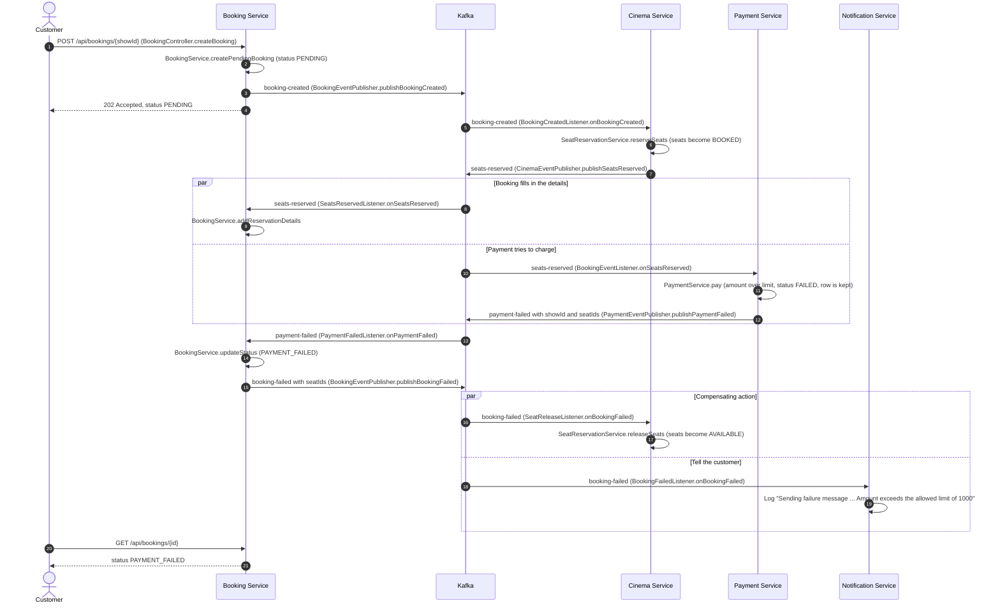

# Phase 8: Booking Flow with Kafka Events

State after Step 4. Services talk only through Kafka events. Nobody waits for anybody.

---

## 1. Small flow (read this first)

```
Customer --> Booking: POST /api/bookings/{showId}   (answer: 202, status PENDING)

Booking  --booking-created-->        Cinema     (reserve the seats)

Cinema   --seats-reserved-->         Payment    (charge the money)
                                     Booking    (fill in movie, seats, total)
Cinema   --seats-reservation-failed--> Booking  (a seat is taken)

Payment  --payment-completed-->      Booking    (mark CONFIRMED)
Payment  --payment-failed-->         Booking    (mark PAYMENT_FAILED)

Booking  --booking-confirmed-->      Notification
Booking  --booking-failed-->         Cinema (release seats) and Notification
```

**Topics and who publishes them**

- `booking-created`: Booking
- `seats-reserved`: Cinema
- `seats-reservation-failed`: Cinema
- `payment-completed`: Payment
- `payment-failed`: Payment
- `booking-confirmed`: Booking
- `booking-failed`: Booking
- `booking-cancelled`: Booking (cancel flow, not drawn here)

**Final booking status in each scenario**

- Scenario 1, booking completed: `CONFIRMED`
- Scenario 2, seat not available: `SEATS_UNAVAILABLE`
- Scenario 3, payment failed: `PAYMENT_FAILED`

**Rules to remember for the next steps**

- The `POST` returns before anything else happens. The client checks the status with `GET /api/bookings/{id}`.
- Every arrow below is "save to database, then publish to Kafka". These are two separate actions. That gap is the subject of Step 5 (message loss) and Step 6 (outbox).
- Order across different topics is not guaranteed. `seats-reserved` has two listeners (Booking and Payment), and either can finish first.
- Each service has its own copy of every event class. The JSON is the contract.

---

## 2. Scenario 1: Booking completed

The happy path. Seats are free and the amount is within the limit of 1000.



**End state**

- Booking: `CONFIRMED`, with movie name, show time, total and seat numbers
- Cinema: seats are `BOOKED`
- Payment: one row with status `SUCCESS`

**Note:** the two `seats-reserved` listeners are independent. They update different columns of the booking, which is why `Booking` has `@DynamicUpdate`.

---

## 3. Scenario 2: Booking failed, seat not available

A requested seat is already `BOOKED`. Cinema refuses, and no payment is attempted.



**End state**

- Booking: `SEATS_UNAVAILABLE`, with `movieName`, `showTime`, `totalAmount` null and no seats. This is expected, because `seats-reserved` was never sent.
- Cinema: seats unchanged
- Payment: no row for this booking

**Note:** this is a business refusal, not a crash. Cinema answers with an event instead of throwing, so Kafka does not retry it.

---

## 4. Scenario 3: Booking failed, payment failed

Seats were reserved, but the amount is over the limit of 1000 (for example 5 seats at 250). The saga must undo the seat reservation.



**End state**

- Booking: `PAYMENT_FAILED`, with movie, total and seat numbers filled in (the seats were reserved before the payment failed)
- Cinema: seats are `AVAILABLE` again
- Payment: one row with status `FAILED` and a failure reason

**Notes**

- The compensating action is `SeatReservationService.releaseSeats`, triggered by `booking-failed`. It is safe to run twice.
- `payment-failed` and `booking-failed` both carry `seatIds`. Payment may answer before Booking has stored the seats, so the release must not depend on Booking's own copy.
- `PaymentService.pay` returns the `FAILED` payment instead of throwing. Throwing inside `@Transactional` would roll back the `FAILED` row.
- `PaymentFailed` is a fact from Payment. `BookingFailed` is Booking's own decision, and it is what Cinema and Notification react to.

---

## 5. Class map

**Booking** (`com.rahul.bookingservice`)

- `controller.BookingController`
- `service.BookingFacade`, `service.BookingService`, `service.AuditService`
- `kafka.publisher.BookingEventPublisher`
- `kafka.listener.SeatsReservedListener`, `SeatsReservationFailedListener`, `PaymentCompletedListener`, `PaymentFailedListener`

**Cinema** (`com.rahul.cinemaservice`)

- `service.SeatReservationService`
- `kafka.publisher.CinemaEventPublisher`
- `kafka.listener.BookingCreatedListener`, `SeatReleaseListener`

**Payment** (`com.rahul.paymentservice`)

- `service.PaymentService`
- `kafka.publisher.PaymentEventPublisher`
- `kafka.listener.BookingEventListener` (listens to `seats-reserved`)

**Notification** (`com.rahul.notificationservice`)

- `kafka.listener.BookingConfirmedListener`, `BookingFailedListener`

---

## 6. Gaps the next steps will close

Each `save, then publish` in these diagrams can lose the message if the service crashes between the two.

- **Step 5:** reproduce the loss. Crash Booking right after `createPendingBooking`, and the booking stays `PENDING` forever.
- **Step 6:** the outbox pattern fixes it.
- **Step 7:** idempotency keys stop a double click from creating two bookings.
- **Step 8:** idempotent consumers make duplicate messages harmless.
- **Step 9:** retries and a dead letter queue handle messages that keep failing.
