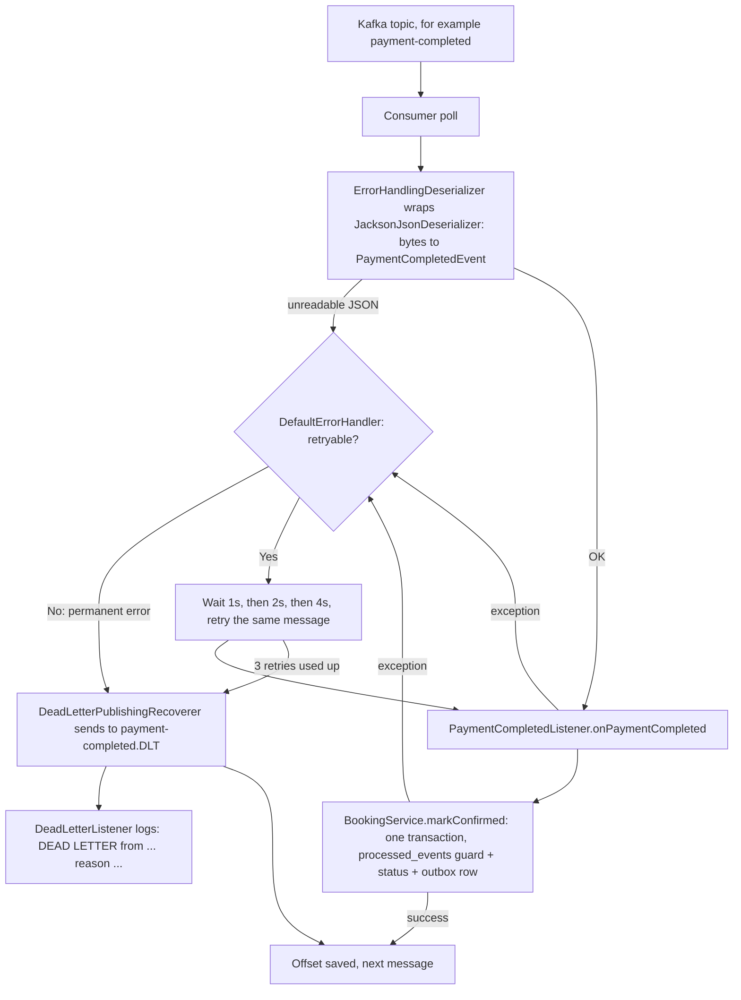
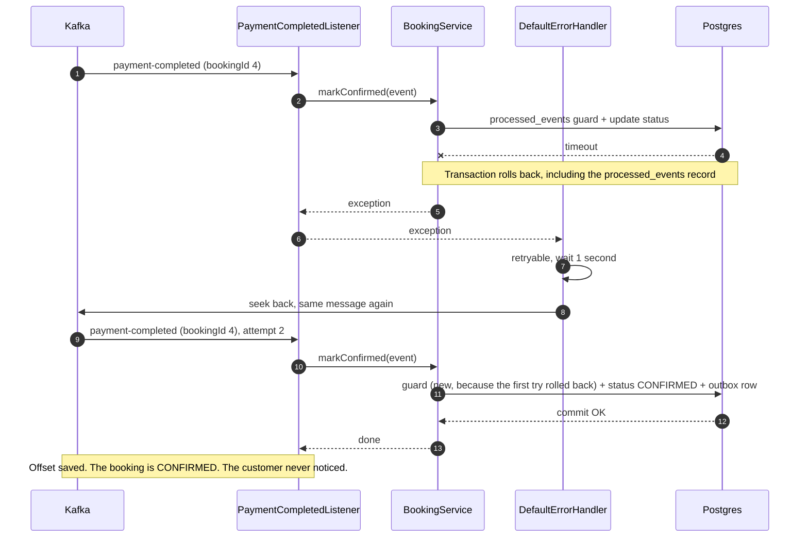
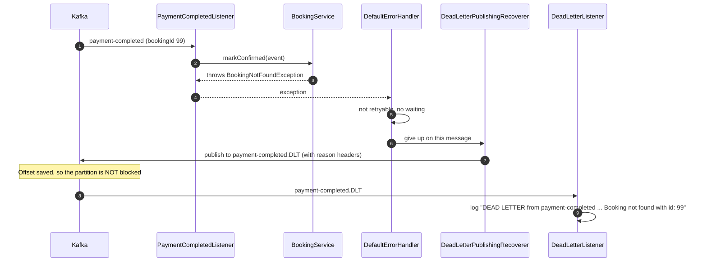
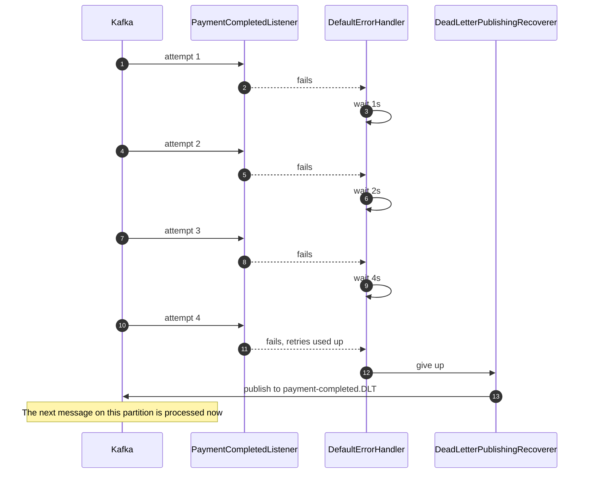
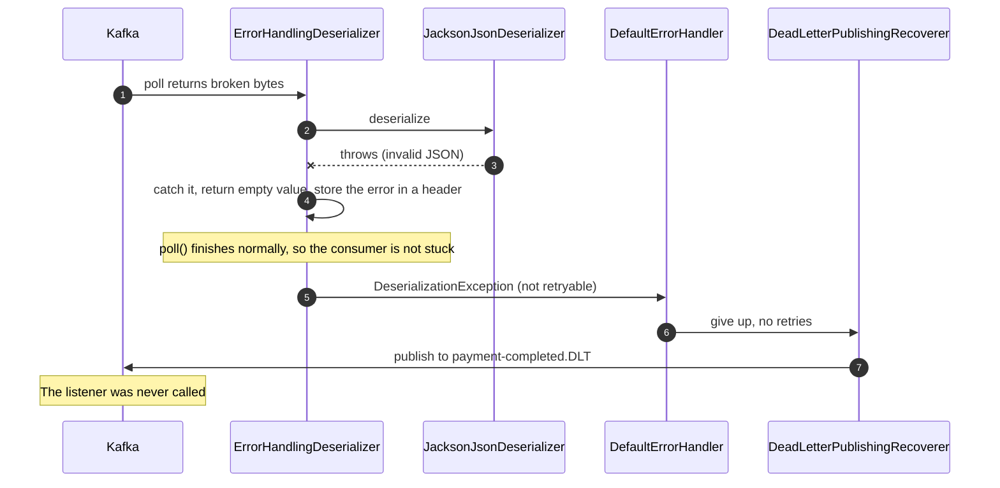

# Retries, Dead Letter Queue and ErrorHandlingDeserializer

Explained with the Booking service.

---

## 1. Why we need it

A Kafka listener can fail while handling a message. Booking has four listeners:

- `SeatsReservedListener` (topic `seats-reserved`)
- `SeatsReservationFailedListener` (topic `seats-reservation-failed`)
- `PaymentCompletedListener` (topic `payment-completed`)
- `PaymentFailedListener` (topic `payment-failed`)

Say `PaymentCompletedListener` throws an exception because the database is busy for a moment. Kafka now has to decide what to do with that message.

**Without a plan**, Spring Kafka retries the same message again and again, with no limit. Every message behind it on that partition waits. If the message can never succeed, for example it points to a booking that does not exist, the partition is blocked forever. Such a message is called a **poison pill**.

**With a plan**, the message gets a few retries, and if it still fails, it is moved to a separate "problem" topic. The listener then carries on with the next message.

**Cinema counter example.** The kitchen gets an order slip it cannot make. The cook tries again after a minute, and again after two. Then the cook puts the slip in a "problem orders" tray and starts the next one. A manager checks the tray later.

---

## 2. The terms

- **Retry:** try the same message again after a failure.
- **Backoff:** the waiting time between retries. Retrying instantly would hit the same struggling system again.
- **Exponential backoff:** the wait grows each time. Ours is 1 second, then 2, then 4.
- **Transient error:** a temporary failure that can go away, like a database timeout. Retrying helps.
- **Permanent error:** a failure that happens every time, like "booking 99 does not exist". Retrying is a waste.
- **Not retryable:** a permanent error that we tell Kafka to skip retrying. It goes straight to the dead letter topic.
- **Poison pill:** a message that can never be processed. It blocks a partition if nothing handles it.
- **Blocking retry:** while the retry waits, the listener thread pauses, and messages behind it on that partition wait too. This keeps order and is the simplest approach.
- **Dead Letter Queue (DLQ):** a separate place for messages that failed all retries.
- **Dead Letter Topic (DLT):** Kafka's version of a DLQ. Named `<original topic>.DLT`, for example `payment-completed.DLT`.
- **Deserializer:** the part that turns the bytes on Kafka back into a Java object.

---

## 3. Where it fits in the flow

Everything so far is the sending side (outbox) and the saving side (idempotent consumer). This step is the **receiving pipeline**, between Kafka and your code.



How it connects to the earlier steps:

- **Outbox (Step 6):** makes sure the message is sent. This step handles what happens when the receiver cannot process it.
- **Idempotent consumer (Step 8):** a failed attempt rolls back its transaction, including the `processed_events` record. So a retry is treated as a first attempt and runs normally. It is not skipped as a duplicate.

---

## 4. The two ways a message can fail

```
bytes arrive --> deserializer --> listener --> BookingService --> done
                      |              |
               fails here (B)    throws here (A)
```

**A. The listener throws an exception.** The message was read correctly, but the work failed. Examples: database down, `BookingNotFoundException`.

- `DefaultErrorHandler` retries, then sends the message to the DLT.
- A permanent error skips the retries.

**B. The message cannot be read.** The bytes are not valid JSON. The deserializer fails inside Kafka's `poll()`, before the listener is called. No listener code can catch it.

- Without protection, the consumer cannot move past that message. It reads the same bytes on every poll and fails again. The partition is stuck.
- `ErrorHandlingDeserializer` catches the failure, and the message goes straight to the DLT with no retries.

---

## 5. What was changed in Booking

### 5.1 The yml: only the `consumer:` block

File: `booking-service/src/main/resources/application.yaml`

**Before**

```yaml
consumer:
  value-deserializer: org.springframework.kafka.support.serializer.JacksonJsonDeserializer
  properties:
    spring.json.use.type.headers: false
    spring.json.trusted.packages: com.rahul.bookingservice.kafka.event
```

**After**

```yaml
consumer:
  value-deserializer: org.springframework.kafka.support.serializer.ErrorHandlingDeserializer
  properties:
    spring.deserializer.value.delegate.class: org.springframework.kafka.support.serializer.JacksonJsonDeserializer
    spring.json.use.type.headers: false
    spring.json.trusted.packages: com.rahul.bookingservice.kafka.event
```

Two lines changed:

1. `value-deserializer` is now the wrapper `ErrorHandlingDeserializer`. Kafka calls this class first.
2. `spring.deserializer.value.delegate.class` is new. It names the real deserializer that the wrapper calls inside. The wrapper itself reads nothing.

### 5.2 `ErrorHandlingDeserializer` in detail

It wraps the real deserializer and catches its failure.

1. The wrapper asks `JacksonJsonDeserializer` to read the bytes.
2. If that works, the wrapper passes on the event object. Nothing changes.
3. If it throws, the wrapper does **not** throw. It returns an empty value and stores the exception in a header of the message.
4. The poll finishes normally, so the consumer moves forward.
5. Spring Kafka sees the exception header and raises a `DeserializationException`. `DefaultErrorHandler` treats that as not retryable, so the message goes straight to the DLT.

### 5.3 The error handler (Java)

File: `booking-service/.../kafka/config/KafkaErrorHandlingConfig.java`

```java
@Bean
public DefaultErrorHandler kafkaErrorHandler(KafkaTemplate<String, Object> kafkaTemplate) {
    DeadLetterPublishingRecoverer recoverer = new DeadLetterPublishingRecoverer(kafkaTemplate,
            (record, ex) -> new TopicPartition(record.topic() + ".DLT", -1));

    ExponentialBackOffWithMaxRetries backOff = new ExponentialBackOffWithMaxRetries(3);
    backOff.setInitialInterval(1000);
    backOff.setMultiplier(2.0);
    backOff.setMaxInterval(10000);

    DefaultErrorHandler handler = new DefaultErrorHandler(recoverer, backOff);
    handler.addNotRetryableExceptions(BookingNotFoundException.class);
    return handler;
}
```

What each part does:

- **`DefaultErrorHandler`:** the decision maker. It catches the listener's exception and decides to retry or give up.
- **`ExponentialBackOffWithMaxRetries(3)`:** three retries, waiting 1s, 2s, 4s. Four attempts in total, about 7 seconds.
- **`DeadLetterPublishingRecoverer`:** runs after the last retry. It publishes the failed message to `<topic>.DLT` and adds headers: original topic, partition, offset, the exception class and message.
- **Partition `-1`:** lets Kafka choose the partition, so the DLT does not need the same number of partitions as the original topic.
- **`addNotRetryableExceptions(BookingNotFoundException.class)`:** a booking that does not exist will not appear on the second try, so skip the waiting.

Spring Boot finds this bean and applies it to every `@KafkaListener` in the service. No listener code changes.

### 5.4 The dead letter listener

File: `booking-service/.../kafka/listener/DeadLetterListener.java`

It listens to `seats-reserved.DLT`, `seats-reservation-failed.DLT`, `payment-completed.DLT` and `payment-failed.DLT`, and logs each one:

```
DEAD LETTER from payment-completed key=4 reason=... payload={"eventId":"...","bookingId":4,...}
```

It reads the message as plain text, because the dead letter is saved as it came.

---

## 6. Sequence diagrams (Booking example)

### Case 1: a temporary failure, then success

`payment-completed` arrives and the database is briefly busy.



### Case 2: a permanent error goes straight to the DLT

`payment-completed` arrives for a booking id that does not exist.



### Case 3: retries run out

The database stays down for the whole retry period.



### Case 4: the message cannot be read

The bytes on `payment-completed` are not valid JSON.



---

## 7. What it does for the Booking flow

| Situation | What happens |
|---|---|
| Database busy for a moment | Retried, then succeeds. No one notices. |
| Booking id does not exist | Straight to the DLT after the first failure. |
| Database down for more than 7 seconds | Dead letter after 4 attempts. The partition continues. |
| Broken JSON on the topic | Straight to the DLT, and the consumer is not stuck. |

A dead-lettered message still leaves its booking in the wrong state. For example, a dead `payment-completed` leaves the booking `PENDING`. The DLT does three things: it isolates the problem, it keeps the data, and it tells you through the log. A person fixes the cause and sends the message again. A replay tool is not part of this phase.

---

## 8. Rules to remember

1. **Retry the temporary, skip the permanent.** A busy database recovers, a missing booking does not.
2. **Expected business answers are events, not errors.** Seat taken and payment declined are normal outcomes, sent as events. Only unexpected failures reach the error handler.
3. **A deserialization failure happens before the listener.** Only the wrapper deserializer can catch it.
4. **Retry works safely with the idempotent consumer.** A failed attempt rolls back its `processed_events` record, so the retry is not mistaken for a duplicate.
5. **Retries block the partition for a short time.** Up to about 7 seconds here. This is the price of the simple approach. `@RetryableTopic` avoids it with extra retry topics, but is more complex.
6. **Every service needs its own copy.** Booking, Cinema, Payment and Notification each have their own `KafkaErrorHandlingConfig` and `DeadLetterListener`. Notification also needed producer settings, because publishing to the DLT makes it a producer.

---

## 9. Interview line

"A failing message used to block its partition while Kafka retried it endlessly. I added a DefaultErrorHandler with three exponential retries, then a dead letter publisher that moves the message to a .DLT topic so the consumer continues. I marked permanent errors like a missing booking as not retryable, and wrapped the JSON deserializer in an ErrorHandlingDeserializer, because a deserialization error is thrown inside poll(), before the listener runs, and would otherwise loop forever."
